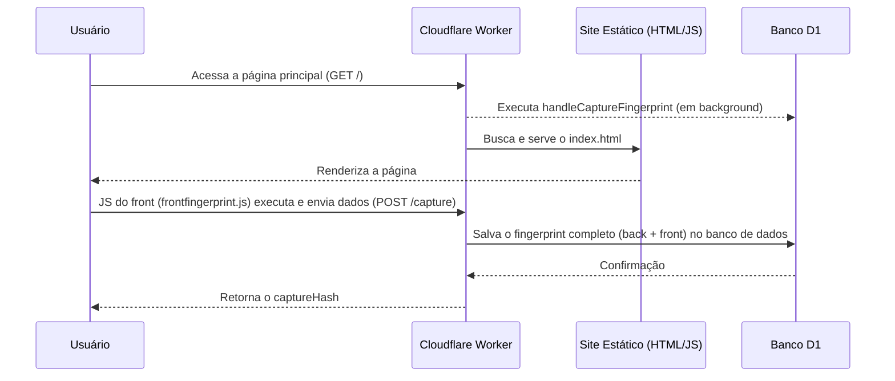

# 🕵️ Advanced Fingerprinting with Cloudflare Workers

Um sistema robusto e de alta performance para captura de *fingerprints* de usuários, construído sobre a stack da Cloudflare (Workers, D1 Database) e projetado para ser flexível e difícil de burlar.

O projeto utiliza uma arquitetura de camada dupla, combinando dados coletados no back-end (Edge) com informações ricas do front-end (navegador) para gerar um identificador único de 128 bits para cada sessão.

---

## ✨ Principais Funcionalidades

-   **🎯 Camada Dupla de Fingerprinting:** Coleta e compara dados da conexão (Worker) e do navegador (JavaScript), tornando a identificação mais precisa e resistente a spoofing.
-   **🚀 Hash de 128 bits:** Utiliza `xxhash128` para gerar hashes extremamente rápidos, consistentes e com probabilidade de colisão estatisticamente nula.
-   **💾 Banco de Dados Estruturado (D1):** Armazena cada ponto de dados do front-end em colunas separadas, permitindo queries ricas e análises detalhadas (ex: `filtrar todos os usuários com GPU NVIDIA`).
-   **⚙️ Painel de Admin Dinâmico:** Uma rota `/admin` protegida por autenticação que usa Handlebars para renderizar listagens e relatórios de forma leve, sem a necessidade de um framework pesado.
-   **🧩 Arquitetura Flexível:** Suporta fontes de dados locais (mock JSON) para testes e remotas (fetch de APIs) para enriquecimento de dados, funcionando perfeitamente em ambientes de desenvolvimento e produção.

---

## 🏛️ Arquitetura e Fluxo de Dados

O fluxo de captura ocorre em duas fases coordenadas pelo Cloudflare Worker, que atua como o controlador central.

---

## 🛠️ Como Funciona: Detalhes Técnicos

### 1. Coleta de Fingerprint

A captura de dados é dividida em duas camadas para máxima precisão.

#### **📍 Back-end (Cloudflare Worker)**
O Worker, por estar no Edge, captura dados puros da conexão:
-   **IP real** do visitante (via `CF-Connecting-IP`)
-   **User-Agent** recebido pelo servidor
-   **País** e **Colo** (datacenter da Cloudflare)
-   Versão e cifra **TLS** da conexão
-   **Hash JA3** (quando disponível na sua zona Cloudflare)

#### **🖥️ Front-end (`frontfingerprint.js`)**
Um script no navegador coleta informações ricas e as envia via `POST /capture` para o Worker. Essas informações são normalizadas em colunas dedicadas no D1:
-   **Informações Básicas:** `userAgent` (do `navigator`), idioma, plataforma (Windows, Linux, etc.).
-   **Capacidades do Navegador:** Suporte a cookies, `localStorage`, `sessionStorage`, e `doNotTrack`.
-   **Tela:** Largura, altura e profundidade de cor.
-   **Hardware:** Threads da CPU (`hardwareConcurrency`), memória do dispositivo (`deviceMemory`).
-   **Canvas Fingerprint:** Renderização de texto e formas com variações para gerar um `toDataURL()` único.
-   **Fontes:** Lista de fontes disponíveis usando a API `FontFaceSet`.
-   **WebGL Fingerprint Avançado:** `vendor` e `renderer` da GPU, e hashes calculados a partir da renderização de shaders.
-   **APIs Modernas:** `MediaCapabilities` (suporte a codecs), `Battery API` (status da bateria) e `Audio Fingerprint` (baseado em `OfflineAudioContext`).

### 2. Estratégia de Hashes

O sistema trabalha com três níveis de hash para análise e identificação, todos calculados com `xxhash128`:
-   `workerHash` → Gerado apenas com dados do back-end.
-   `frontHash` → Gerado apenas com a massa de dados do front-end.
-   `captureHash` → A hash final, combinando `workerHash` + `frontHash` para máxima unicidade.

### 3. Painel de Administração (`/admin`)

A rota `/admin` é protegida por **Basic Auth**, configurada via secrets no Worker. Ela usa **Handlebars** para renderizar dinamicamente a listagem dos últimos 100 fingerprints, permitindo a criação de templates HTML de forma simples e rápida, direto do Edge.

### 4. Fontes de Dados (JSON Local/Remoto)

A arquitetura foi projetada para ser flexível:
-   **Local:** Para desenvolvimento, o Worker pode ser configurado para carregar um arquivo `.json` local que sirva como mock de dados.
-   **Remoto:** O sistema pode consumir via `fetch()` um endpoint externo, abrindo espaço para enriquecer dados com APIs de terceiros (ex: geolocalização de IP) ou comparar fingerprints de diferentes origens.

---
